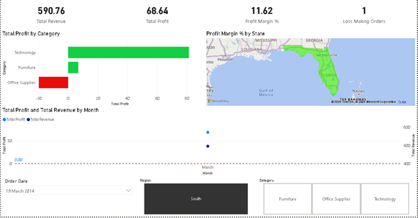
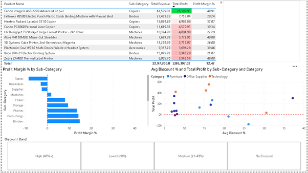
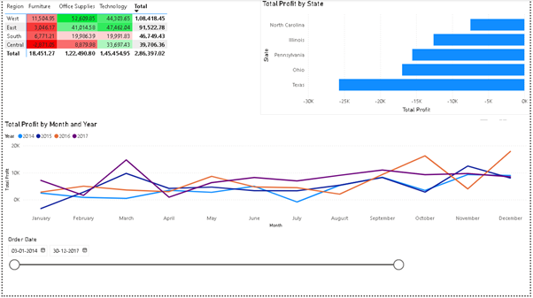

# Retail-Sales-Profitability-Analysis
Power BI | DAX | Data Analysis project investigating declining profitability despite strong sales. Explores discount impact, loss-making products, regional performance, profit margins, and seasonal trends using the Superstore dataset.

## Tools Used
- Power BI
- DAX
- Excel
- Power Query

## Business Problem
Why is profit decreasing despite high sales?

## Key Findings
- **Furniture** with an average profit margin of **3.9%** , significantly lower than Technology (**15.6%**).
- The **Central region** recorded a **negative overall margin (-10.4%)**
- Orders with **40%+ discounts** averaged **-06.71 profit per order**, compared to **+66.90 profit per order** for orders with no discount.
- Profitability improved from **10.2% in 2014** to **13.4% in 2016**, before declining slightly to **12.7% in 2017**.

## Recommendations
- Limit discounts above 40% to prevent margin erosion.
- Review pricing and profitability of Furniture products.
- Improve performance in the Central region through targeted pricing and sales strategies.
- Increase focus on high-margin Technology products.
- Monitor profit and margin KPIs alongside sales revenue.

## Conclusion
The analysis indicates that profit is decreasing despite high sales primarily because aggressive discounting and low-margin product categories are eroding profitability. By controlling discounts, improving Furniture category performance, and focusing on profitable products and regions, the business can increase profit without necessarily increasing sales volume.

## Dashboard Preview
### Executive Summary

### Product Analysis

### Regional & Seasonal Analysis

## Dataset
[Superstore Sales — Kaggle](https://www.kaggle.com/datasets/vivek468/superstore-dataset-final)
9,994 orders · 21 columns · Jan 2014 – Dec 2017
